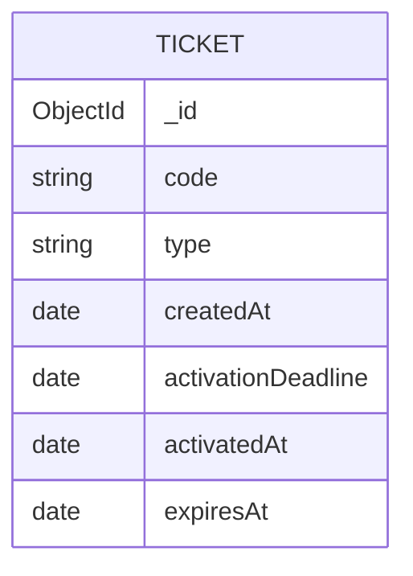

# Zootickets

Zootickets är ett enkelt fullstack-biljettsystem byggt med Next.js, React, Node.js, Express och MongoDB.

> **Observera:** Projektet är en demoversion skapad i utbildningssyfte. Det är inte avsett att användas som ett färdigt biljettsystem i produktion.

I systemet kan en användare:

- Skapa en biljett med en slumpmässig och unik kod
- Välja mellan flera biljettyper
- Aktivera en biljett genom att ange biljettkoden
- Se om en biljett är använd eller oanvänd
- Lista alla biljetter
- Radera en biljett som ännu inte har aktiverats

En aktiverad biljett kan inte aktiveras igen eller raderas.

## Teknik

### Frontend

- Next.js
- React
- TypeScript
- CSS Modules
- Vitest
- Testing Library

### Backend

- Node.js
- Express
- TypeScript
- Mongoose
- Vitest
- Supertest

### Databas

- MongoDB

## Projektstruktur

```text
zootickets/
├── backend/
│   ├── src/
│   │   ├── models/
│   │   ├── utils/
│   │   ├── app.ts
│   │   ├── db.ts
│   │   └── server.ts
│   └── tests/
├── frontend/
│   └── src/
│       ├── app/
│       └── test/
└── README.md
```

## Databasdesign

Varje dokument i samlingen `tickets` representerar en biljett.



Fält:

- `_id`: MongoDB:s unika id för dokumentet
- `code`: slumpmässigt genererad och unik biljettkod
- `type`: biljettens typ
- `createdAt`: när biljetten skapades
- `activationDeadline`: sista tidpunkt då biljetten kan aktiveras
- `activatedAt`: när biljetten aktiverades, eller `null` om den är oanvänd
- `expiresAt`: när den aktiverade biljetten slutar gälla, eller `null` om den är oanvänd

Tillåtna biljettyper är:

- `day-ticket`
- `two-day-ticket`
- `season-ticket`
- `family-ticket`

## Hur Node.js och MongoDB samarbetar

Backendservern körs med Node.js och använder Express för att ta emot HTTP-anrop från frontend.

Mongoose används för att ansluta Node.js-applikationen till MongoDB. Biljettmodellen beskriver vilka fält ett biljettdokument ska innehålla och vilka regler som gäller, till exempel att biljettkoden måste vara unik.

När backend tar emot ett anrop använder den Mongoose för att skapa, läsa, uppdatera eller radera dokument i MongoDB. Resultatet skickas sedan tillbaka till frontend som JSON.

Flödet ser förenklat ut så här:

```text
Frontend → Express API → Mongoose → MongoDB
Frontend ← JSON-svar ← Express API ← MongoDB
```

## CORS

Frontend och backend körs på olika adresser under utveckling:

- Frontend: `http://localhost:3000`
- Backend: `http://localhost:3005`

Webbläsaren betraktar dessa som olika origins eftersom portnumren skiljer sig. Webbläsarens same-origin-policy skulle därför normalt blockera frontend från att anropa backend.

Backend använder paketet `cors` och tillåter anrop från frontendadressen:

```ts
app.use(cors({ origin: "http://localhost:3000" }));
```

Det innebär att backend skickar rätt CORS-header och att webbläsaren tillåter kommunikationen mellan applikationens två delar.

## Förutsättningar

För att köra projektet behövs:

- Node.js 20.12 eller senare
- npm
- En MongoDB-server som körs lokalt

## Miljövariabler

Skapa filen `backend/.env`:

```env
MONGODB_URI=mongodb://127.0.0.1:27017/zootickets
MONGODB_URI_TEST=mongodb://127.0.0.1:27017/zootickets_test
```

Skapa filen `frontend/.env.local`:

```env
NEXT_PUBLIC_API_URL=http://localhost:3005
```

Miljöfilerna ska inte committas eftersom de kan innehålla känslig information.

## Installation

Installera backendens paket:

```bash
cd backend
npm install
```

Installera frontendens paket:

```bash
cd frontend
npm install
```

## Starta projektet

MongoDB måste vara igång innan backend startas.

Starta backend från mappen `backend`:

```bash
npm run dev
```

Backend körs på `http://localhost:3005`.

Öppna därefter en andra terminal och starta frontend från mappen `frontend`:

```bash
npm run dev
```

Frontend kan öppnas på `http://localhost:3000`.

## API-endpoints

### Lista alla biljetter

```http
GET /tickets
```

### Hämta en biljett

```http
GET /tickets/:code
```

### Skapa en biljett

```http
POST /tickets
Content-Type: application/json
```

Exempel på request body:

```json
{
  "type": "day-ticket"
}
```

### Aktivera en biljett

```http
PATCH /tickets/:code/activate
```

En biljett kan endast aktiveras en gång och måste aktiveras före sitt sista aktiveringsdatum.

### Radera en biljett

```http
DELETE /tickets/:code
```

Endast biljetter som inte har aktiverats kan raderas.

## Tester

Backendtester:

```bash
cd backend
npm test -- --run
```

Frontendtester:

```bash
cd frontend
npm test -- --run
```

Kontrollera backendens TypeScript:

```bash
cd backend
npm run typecheck
```

Kontrollera frontendens kod:

```bash
cd frontend
npm run lint
```

Skapa ett produktionsbygge av frontend:

```bash
cd frontend
npm run build
```

Projektet innehåller tester för bland annat:

- Skapande av biljetter
- Validering av biljettyp
- Lagring i databasen
- Listning av biljetter
- Aktivering av biljetter
- Skydd mot återanvändning
- Radering av oanvända biljetter
- Visning och anrop i frontend

## Arbetssätt

Projektet har utvecklats med inspiration från metoden red, green, refactor:

1. Ett test skrivs och misslyckas.
2. Den minsta kod som får testet att passera skrivs.
3. Koden förbättras utan att testet slutar fungera.

## Problem och lösning

Backendens integrationstester använder Vitest och Supertest mot en gemensam MongoDB-testdatabas. Varje testfil rensar databasen med `Ticket.deleteMany({})` efter sina tester.

Vitest kör testfiler parallellt som standard. Det innebar att en testfil kunde radera biljetter medan en annan testfil fortfarande använde dem. Resultatet blev oregelbundna fel, bland annat 404-svar och timeouts. Testerna kunde passera när de kördes separat men misslyckas när hela testsviten kördes.

Problemet löstes genom att köra testfilerna sekventiellt:

```json
"test": "vitest --fileParallelism=false"
```

Lärdomen är att integrationstester som delar databas antingen behöver köras sekventiellt eller använda en separat databas för varje testfil eller worker.

## Säkerhet och fortsatt utveckling

Det här projektet är en demoversion och innehåller därför ingen inloggning eller behörighetskontroll. Alla som har tillgång till API:t kan lista biljetter och radera oanvända biljetter.

Backend kontrollerar redan att:

- Endast godkända biljettyper kan skapas
- En biljett inte kan aktiveras efter sista aktiveringsdatum
- En biljett inte kan aktiveras flera gånger
- En aktiverad biljett inte kan raderas

En färdig produkt skulle även behöva innehålla:

- Inloggning och säker autentisering
- Olika behörigheter för kunder och administratörer
- Skyddade API-endpoints
- Säker hantering av användaruppgifter
- Loggning av viktiga händelser
- Begränsning av upprepade anrop
- Anpassad konfiguration för produktion
