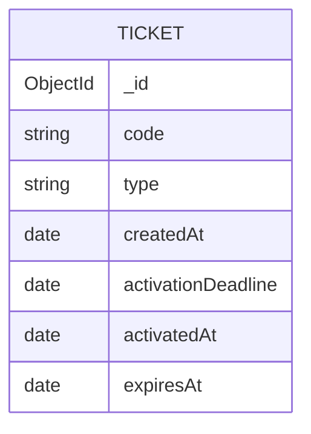

# Zootickets

Zootickets is a simple full-stack ticket system built with Next.js, React, Node.js, Express, and MongoDB.

## Project Information

- Author: Kim Säfsten
- Class: SYS25D
- Course: API-utveckling Node.js
- School: Medieinstitutet

> **Note:** This project is a demo version created for educational purposes. It is not intended to be used as a production-ready ticket system.

In the system, a user can:

- Create a ticket with a random and unique code
- Choose between multiple ticket types
- Activate a ticket by entering the ticket code
- See if a ticket is used or unused
- List all tickets
- Delete a ticket that has not yet been activated

An activated ticket cannot be activated again or deleted.

## Technology

### Frontend

- Next.js
- React
- TypeScript
- CSS Modules
- Vitest
- Testing Library

### Backend

- Node.js
- Express
- TypeScript
- Mongoose
- Vitest
- Supertest

### Database

- MongoDB

## Project Structure

```text
zootickets/
├── backend/
│   ├── src/
│   │   ├── models/
│   │   ├── utils/
│   │   ├── app.ts
│   │   ├── db.ts
│   │   └── server.ts
│   └── tests/
├── frontend/
│   └── src/
│       ├── app/
│       └── test/
└── README.md
```

## Database Design

Each document in the `tickets` collection represents a ticket.



Fields:

- `_id`: MongoDB's unique ID for the document
- `code`: randomly generated and unique ticket code
- `type`: the ticket type
- `createdAt`: when the ticket was created
- `activationDeadline`: the last time the ticket can be activated
- `activatedAt`: when the ticket was activated, or `null` if unused
- `expiresAt`: when the activated ticket expires, or `null` if unused

Allowed ticket types are:

- `day-ticket`
- `two-day-ticket`
- `season-ticket`
- `family-ticket`

## How Node.js and MongoDB Work Together

The backend server runs with Node.js and uses Express to receive HTTP requests from the frontend.

Mongoose is used to connect the Node.js application to MongoDB. The Ticket model describes which fields a ticket document should contain and what rules apply, such as the ticket code must be unique.

When the backend receives a request, it uses Mongoose to create, read, update, or delete documents in MongoDB. The result is then sent back to the frontend as JSON.

The flow looks simplified like this:

```text
Frontend → Express API → Mongoose → MongoDB
Frontend ← JSON response ← Express API ← MongoDB
```

## CORS

The frontend and backend run at different addresses during development:

- Frontend: `http://localhost:3000`
- Backend: `http://localhost:3005`

The browser treats these as different origins because the port numbers differ. The browser's same-origin policy would normally block the frontend from calling the backend.

The backend uses the `cors` package and allows requests from the frontend address:

```ts
app.use(cors({ origin: "http://localhost:3000" }));
```

This means the backend sends the correct CORS headers and the browser allows communication between the two parts of the application.

## Requirements

To run the project, you need:

- Node.js 20.12 or later
- npm
- A MongoDB server running locally

## Environment Variables

Create the file `backend/.env`:

```env
MONGODB_URI=mongodb://127.0.0.1:27017/zootickets
MONGODB_URI_TEST=mongodb://127.0.0.1:27017/zootickets_test
```

Create the file `frontend/.env.local`:

```env
NEXT_PUBLIC_API_URL=http://localhost:3005
```

Environment files should not be committed as they may contain sensitive information.

## Installation

Install backend dependencies:

```bash
cd backend
npm install
```

Install frontend dependencies:

```bash
cd frontend
npm install
```

## Start the Project

MongoDB must be running before the backend is started.

Start the backend from the `backend` folder:

```bash
npm run dev
```

The backend runs on `http://localhost:3005`.

Then open a second terminal and start the frontend from the `frontend` folder:

```bash
npm run dev
```

The frontend can be opened at `http://localhost:3000`.

## API Endpoints

### List all tickets

```http
GET /tickets
```

### Get a ticket

```http
GET /tickets/:code
```

### Create a ticket

```http
POST /tickets
Content-Type: application/json
```

Example request body:

```json
{
  "type": "day-ticket"
}
```

### Activate a ticket

```http
PATCH /tickets/:code/activate
```

A ticket can only be activated once and must be activated before its activation deadline.

### Delete a ticket

```http
DELETE /tickets/:code
```

Only tickets that have not been activated can be deleted.

## Tests

Backend tests:

```bash
cd backend
npm test -- --run
```

Frontend tests:

```bash
cd frontend
npm test -- --run
```

Check backend TypeScript:

```bash
cd backend
npm run typecheck
```

Check frontend code:

```bash
cd frontend
npm run lint
```

Create a production build of the frontend:

```bash
cd frontend
npm run build
```

The project includes tests for, among other things:

- Creating tickets
- Validating ticket types
- Storing in the database
- Listing tickets
- Activating tickets
- Protection against reuse
- Deleting unused tickets
- Displaying and calling in the frontend

## Approach

The project has been developed with inspiration from the red, green, refactor approach:

1. A test is written and fails.
2. The minimal code to make the test pass is written.
3. The code is improved without the test stopping working.

## Problem and Solution

The backend integration tests use Vitest and Supertest against a shared MongoDB test database. Each test file cleans the database with `Ticket.deleteMany({})` after its tests.

Vitest runs test files in parallel by default. This meant one test file could delete tickets while another test file was still using them. The result was sporadic errors, including 404 responses and timeouts. The tests could pass when run separately but fail when the entire test suite ran.

The problem was solved by running test files sequentially:

```json
"test": "vitest --fileParallelism=false"
```

Lärdomen är att integrationstester som delar databas antingen behöver köras sekventiellt eller använda en separat databas för varje testfil eller worker.

## Säkerhet och fortsatt utveckling

Det här projektet är en demoversion och innehåller därför ingen inloggning eller behörighetskontroll. Alla som har tillgång till API:t kan lista biljetter och radera oanvända biljetter.

Backend kontrollerar redan att:

- Endast godkända biljettyper kan skapas
- En biljett inte kan aktiveras efter sista aktiveringsdatum
- En biljett inte kan aktiveras flera gånger
- En aktiverad biljett inte kan raderas

En färdig produkt skulle även behöva innehålla:

- Inloggning och säker autentisering
- Olika behörigheter för kunder och administratörer
- Skyddade API-endpoints
- Säker hantering av användaruppgifter
- Loggning av viktiga händelser
- Begränsning av upprepade anrop
- Anpassad konfiguration för produktion
